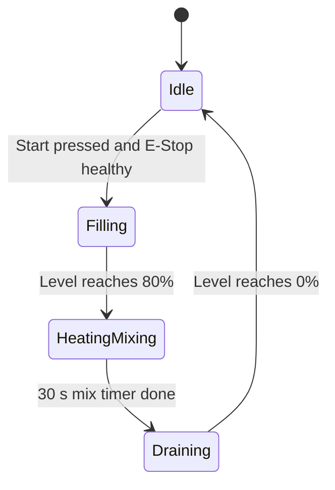

# Industrial Batch-Mixing & Thermal Control Simulation

An automated industrial batch process simulation built in **CODESYS V3.5** and designed using **ISA-5.1 P&ID standards**. The system controls fluid filling, jacket heating, mechanical agitation, and gravity draining, with simulated transmitter feedback and an interactive operator HMI.

## Piping & Instrumentation Diagram (P&ID)

Designed in Draw.io, following ISA-5.1 standards:


## Process Equipment & ISA Tag Mapping

| Tag | Description | Address | Signal |
|---|---|---|---|
| **TK-101** | Batch tank (main mixing and heating vessel) | n/a | n/a |
| **FCV-101** | Inlet fill valve (solenoid) | `%QX0.0` | Digital output |
| **FCV-102** | Drain valve (solenoid) | `%QX0.1` | Digital output |
| **M-101** | Agitator motor contactor | `%QX0.2` | Digital output |
| **M-101 (feedback)** | Agitator auxiliary run feedback | `%IX0.4` | Digital input |
| **HTR-101** | Immersion heater contactor | `%QX0.3` | Digital output |
| **LT-101** | Level transmitter | `%IW0` | Analog input, raw `0-27648` scaled to `0.0-100.0 %` |
| **TT-101** | Temperature transmitter | `%IW1` | Analog input, raw `0-27648` scaled to `0.0-120.0 °C` |

## Sequence of Operations

| State | Name | Description |
|---|---|---|
| **0** | Idle | Waits for healthy safety interlocks (`E-Stop = TRUE`) and the Start pushbutton. |
| **10** | Filling | `FCV-101` opens; the tank fills until the level reaches `80 %`. |
| **20** | Heating & Mixing | `FCV-101` closes; `M-101` (agitator) and `HTR-101` (heater) run together for the 30-second mix cycle. |
| **30** | Draining | Agitator and heater shut off; `FCV-102` opens until the tank is empty (`0 %`). |

After draining, the cycle completes and the system returns to State 0.



## HMI Operator Visualization

Live monitoring and manual controls built directly inside CODESYS:


## Project Structure

```text
batch-mixing-process-simulation/
│
├── BatchMix_ProcessControl.backup.project   # CODESYS project (open this)
├── ACT_Simulation.txt                       # Process simulation logic (exported source)
├── GVL_Process.txt                          # Global variable list (exported source)
├── pid_diagram.drawio                       # Editable P&ID source (Draw.io)
├── pid_diagram.png                          # P&ID image
├── hmi_screenshot.png                       # HMI screenshot
└── README.md
```

## Prerequisites

- **CODESYS Development System V3.5** (the built-in simulation is used, so no PLC hardware is needed)
- **Draw.io** (optional, only to edit `pid_diagram.drawio`)

## How to Open & Run the Project

1. Download or clone this repository.
2. In CODESYS, go to **File** → **Open Project...** and select `BatchMix_ProcessControl.backup.project`.
3. Go to **Online** → **Simulation** and make sure it is checked.
4. Press **F11** to build, **Alt + F8** to log in, and **F5** to start.
5. Open the **Visualization** tab and click **START BATCH**.
