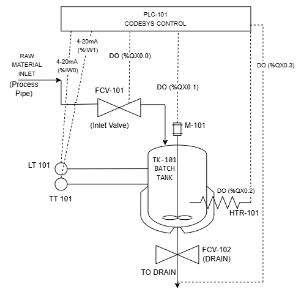
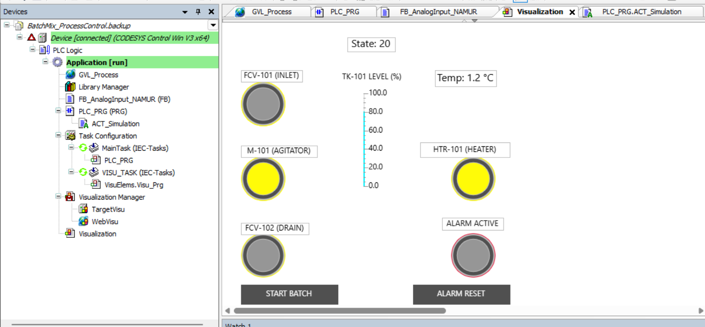

# Industrial Batch-Mixing & Thermal Control Simulation

An automated industrial batch process simulation built in **CODESYS V3.5** and designed using **ISA-5.1 P&ID standards**. The system controls fluid filling, jacket heating, mechanical agitation, and gravity draining with simulated transmitter feedback and an interactive operator HMI.
---

## Piping & Instrumentation Diagram (P&ID)

Designed in Draw.io adhering to ISA-5.1 standards:

---

## Process Equipment & ISA Tag Mapping

* **TK-101 (Batch Tank):** Main mixing and heating vessel.
* **FCV-101 (Inlet Valve):** `%QX0.0` — Solenoid fill valve.
* **FCV-102 (Drain Valve):** `%QX0.1` — Solenoid discharge valve.
* **M-101 (Agitator Motor):** `%QX0.2` — Mixing contactor coil with auxiliary run feedback (`%IX0.4`).
* **HTR-101 (Immersion Heater):** `%QX0.3` — Process heating contactor.
* **LT-101 (Level Transmitter):** `%IW0` — Raw ADC (`0–27648`) scaled to `0.0–100.0%`.
* **TT-101 (Temperature Transmitter):** `%IW1` — Raw ADC (`0–27648`) scaled to `0.0–120.0 °C`.

---

## Sequence of Operations

* **State 0 (Idle):** System waits for healthy safety interlocks (`E-Stop = TRUE`) and Start pushbutton trigger.
* **State 10 (Filling):** `FCV-101` opens; tank fills until level reaches `80%`.
* **State 20 (Heating & Mixing):** `FCV-101` closes; `M-101` (Agitator) and `HTR-101` (Heater) run concurrently for the 30-second mix cycle.
* **State 30 (Draining):** Agitator and heater shut off; `FCV-102` opens until tank empties (`0%`).
* **Cycle Complete:** System returns to State 0.

---

## HMI Operator Visualization

Live monitoring and manual controls built directly inside CODESYS:

---

## How to Open & Run the Project

1. Download the `BatchControl.projectarchive` file from this repository.
2. In CODESYS V3.5, go to **File** → **Project Archive** → **Extract Archive...** and select the downloaded file.
3. Go to **Online** → **Simulation** (ensure it is checked).
4. Press **F11** to build, **Alt + F8** to Login, and **F5** to Start.
5. Open the **Visualization** tab and click **START BATCH**.
